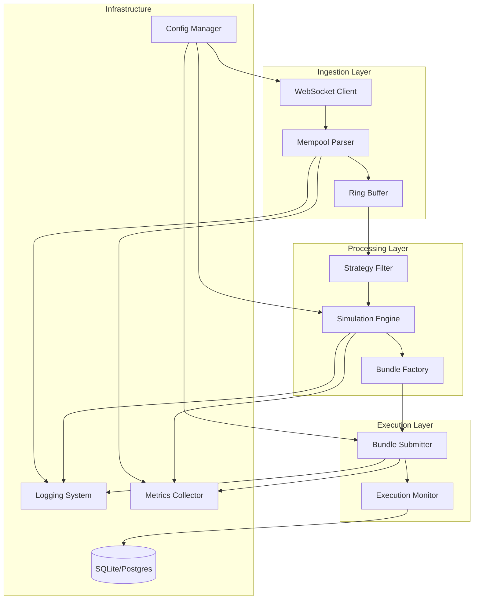

# Design Document

## Overview

The MEV bot is designed as a high-performance, modular system built in Rust using Tokio for async operations. The architecture follows a pipeline pattern optimized for ultra-low latency, with each component designed for concurrent operation and minimal blocking. The system integrates with HyperEVM mainnet while maintaining safety through dummy-value transactions and comprehensive monitoring.

## Architecture

### High-Level System Architecture



### Core Pipeline Flow

1. **Ingestion**: WebSocket → Parser → Ring Buffer
2. **Filtering**: Ring Buffer → Strategy Filter → Candidates
3. **Simulation**: Candidates → Simulation Engine → Profit Analysis
4. **Execution**: Profitable Opportunities → Bundle Builder → Submission
5. **Monitoring**: All stages → Metrics → Grafana Dashboards

## Components and Interfaces

### 1. Mempool Ingestion System

**Location**: `crates/mev-mempool/`

**Key Components**:
- `WebSocketClient`: Manages eth_subscribe connections with auto-reconnect
- `TransactionParser`: Concurrent parsing with ABI decoding
- `RingBuffer`: Lock-free crossbeam-based storage
- `ABIDecoder`: Precompiled signatures for major protocols

**Interface**:
```rust
pub trait MempoolIngestion {
    async fn start(&mut self) -> Result<()>;
    fn get_transaction_stream(&self) -> Receiver<ParsedTransaction>;
    fn get_metrics(&self) -> MempoolMetrics;
}
```

**Performance Targets**:
- Detection latency: median ≤20ms, p95 ≤50ms
- Throughput: Handle 1000+ txs/sec
- Memory: Bounded ring buffer with configurable size

### 2. Simulation Engine

**Location**: `crates/mev-core/simulation/`

**Key Components**:
- `ForkSimulator`: eth_call with state override
- `GasEstimator`: Accurate gas cost calculation
- `ProfitCalculator`: Net profit after costs
- `StateManager`: Lightweight state tracking

**Interface**:
```rust
pub trait SimulationEngine {
    async fn simulate_bundle(&self, bundle: &Bundle) -> Result<SimulationResult>;
    async fn estimate_profit(&self, opportunity: &Opportunity) -> Result<ProfitEstimate>;
    fn get_throughput_metrics(&self) -> SimulationMetrics;
}
```

**Performance Targets**:
- Simulation throughput: ≥200 sims/sec
- Decision latency: median ≤25ms, p95 ≤75ms
- Accuracy: Match on-chain execution results

### 3. Strategy System

**Location**: `crates/mev-strategies/`

**Strategy Types**:
- `BackrunStrategy`: Detect price movements, capture spread
- `SandwichStrategy`: Pre/post transaction with slippage protection
- `ArbitrageStrategy`: Cross-DEX price differences
- `LiquidationStrategy`: Undercollateralized positions

**Interface**:
```rust
pub trait Strategy {
    fn name(&self) -> &str;
    fn evaluate(&self, tx: &ParsedTransaction) -> Option<Opportunity>;
    fn build_bundle(&self, opportunity: &Opportunity) -> Result<Bundle>;
    fn is_enabled(&self) -> bool;
}
```

**Configuration**:
```yaml
strategies:
  backrun:
    enabled: true
    min_profit_wei: 1000000000000000  # 0.001 ETH
    max_gas_price: 100000000000       # 100 gwei
  sandwich:
    enabled: false
    slippage_tolerance: 0.005         # 0.5%
```

### 4. Bundle Management

**Location**: `crates/mev-core/bundle/`

**Key Components**:
- `BundleBuilder`: Construct preTx/targetTx/postTx sequences
- `TransactionSigner`: EIP-1559 signing with nonce management
- `BundleSubmitter`: Multiple submission paths (direct/bundle RPC)
- `ExecutionTracker`: Monitor inclusion and results

**Interface**:
```rust
pub trait BundleManager {
    async fn build_bundle(&self, opportunity: &Opportunity) -> Result<Bundle>;
    async fn submit_bundle(&self, bundle: &Bundle) -> Result<SubmissionResult>;
    async fn track_execution(&self, bundle_id: &str) -> Result<ExecutionStatus>;
}
```

### 5. Configuration System

**Location**: `crates/mev-config/`

**Environment Profiles**:
- `dev.yml`: Local development with anvil
- `testnet.yml`: Hyperliquid testnet configuration
- `mainnet.yml`: Production mainnet settings

**Key Configuration Areas**:
```yaml
network:
  rpc_url: "https://api.hyperliquid.xyz/evm"
  ws_url: "wss://api.hyperliquid.xyz/ws"
  chain_id: 998

performance:
  worker_threads: 4
  ring_buffer_size: 10000
  simulation_timeout_ms: 100

security:
  private_key_file: "/secure/keys/bot.key"
  max_gas_price: 200000000000
  kill_switch_enabled: true
```

## Data Models

### Core Transaction Types

```rust
#[derive(Debug, Clone, Serialize, Deserialize)]
pub struct ParsedTransaction {
    pub hash: H256,
    pub from: Address,
    pub to: Option<Address>,
    pub value: U256,
    pub gas_limit: U256,
    pub gas_price: U256,
    pub nonce: U256,
    pub input: Bytes,
    pub target_type: Option<TargetType>,
    pub function_signature: Option<String>,
    pub decoded_params: Option<DecodedParams>,
    pub timestamp: DateTime<Utc>,
}

#[derive(Debug, Clone)]
pub enum TargetType {
    UniswapV2,
    UniswapV3,
    SushiSwap,
    Curve,
    Balancer,
    ERC20Transfer,
    Unknown,
}
```

### Strategy and Bundle Types

```rust
#[derive(Debug, Clone)]
pub struct Opportunity {
    pub strategy: String,
    pub target_tx: ParsedTransaction,
    pub estimated_profit: U256,
    pub gas_estimate: U256,
    pub confidence: f64,
    pub expiry: DateTime<Utc>,
}

#[derive(Debug, Clone)]
pub struct Bundle {
    pub id: String,
    pub transactions: Vec<SignedTransaction>,
    pub target_block: u64,
    pub max_gas_price: U256,
    pub profit_estimate: U256,
}
```

### Metrics and Monitoring

```rust
#[derive(Debug, Clone, Serialize)]
pub struct SystemMetrics {
    pub mempool: MempoolMetrics,
    pub simulation: SimulationMetrics,
    pub execution: ExecutionMetrics,
    pub timestamp: DateTime<Utc>,
}

#[derive(Debug, Clone, Serialize)]
pub struct MempoolMetrics {
    pub transactions_per_second: f64,
    pub detection_latency_ms: LatencyStats,
    pub buffer_utilization: f64,
    pub dropped_transactions: u64,
}
```

## Error Handling

### Error Categories and Recovery Strategies

1. **Network Errors**:
   - WebSocket disconnections → Exponential backoff reconnection
   - RPC timeouts → Failover to backup endpoints
   - Rate limiting → Adaptive request throttling

2. **Simulation Errors**:
   - Stale state → Refresh and retry
   - Gas estimation failures → Conservative fallback estimates
   - Revert simulations → Log and skip opportunity

3. **Execution Errors**:
   - Nonce collisions → Increment and resubmit
   - Gas price too low → Bump gas and resubmit
   - Bundle rejection → Analyze and adjust strategy

4. **System Errors**:
   - Memory pressure → Reduce buffer sizes and alert
   - CPU overload → Throttle processing and scale
   - Disk space → Rotate logs and cleanup

### Error Recovery Implementation

```rust
#[derive(Debug, thiserror::Error)]
pub enum MevBotError {
    #[error("Network error: {0}")]
    Network(#[from] NetworkError),
    
    #[error("Simulation failed: {0}")]
    Simulation(String),
    
    #[error("Bundle execution failed: {0}")]
    Execution(String),
    
    #[error("Configuration error: {0}")]
    Config(String),
}

pub struct ErrorRecovery {
    retry_policy: RetryPolicy,
    circuit_breaker: CircuitBreaker,
    fallback_strategies: Vec<Box<dyn FallbackStrategy>>,
}
```

## Testing Strategy

### Unit Testing Approach

1. **Component Isolation**: Each module tested independently with mocks
2. **Property-Based Testing**: Use `proptest` for transaction parsing edge cases
3. **Performance Testing**: Benchmark critical paths with `criterion`
4. **Concurrency Testing**: Stress test lock-free data structures

### Integration Testing

1. **Anvil Fork Testing**: Full pipeline testing with local blockchain
2. **Victim Generator**: Controlled test scenarios with predictable outcomes
3. **End-to-End Flows**: Complete mempool → execution → monitoring cycles
4. **Chaos Testing**: Network failures, RPC slowdowns, memory pressure

### Testing Infrastructure

```rust
// Test utilities for consistent testing
pub struct TestHarness {
    pub anvil: AnvilInstance,
    pub victim_generator: VictimGenerator,
    pub mock_mempool: MockMempoolProvider,
    pub metrics_collector: TestMetricsCollector,
}

impl TestHarness {
    pub async fn setup() -> Self { /* ... */ }
    pub async fn generate_test_scenario(&self, scenario: TestScenario) -> TestResult;
    pub fn assert_latency_targets(&self, metrics: &SystemMetrics);
}
```

### Performance Benchmarks

Target benchmarks to validate against requirements:
- Mempool ingestion: 1000+ txs/sec with <20ms latency
- Simulation throughput: 200+ sims/sec
- Decision loop: <25ms median latency
- Bundle inclusion: >60% success rate in controlled tests

## Security Considerations

### Key Management

1. **Private Key Storage**: Encrypted files, never in code/containers
2. **HSM Integration**: Support for hardware security modules
3. **Multi-sig Support**: Documentation for multi-signature setups
4. **Key Rotation**: Procedures for secure key updates

### Operational Security

1. **Kill Switch**: Immediate shutdown capability via API/signal
2. **Rate Limiting**: Prevent excessive transaction submission
3. **Value Limits**: Maximum transaction values and gas prices
4. **Audit Logging**: Immutable logs of all critical operations

### Network Security

1. **TLS Everywhere**: Encrypted connections to all external services
2. **API Authentication**: Secure authentication for management APIs
3. **Firewall Rules**: Minimal network exposure
4. **VPN/Bastion**: Secure access to production systems

## Deployment Architecture

### Container Strategy

```dockerfile
# Multi-stage build for minimal production image
FROM rust:1.70 as builder
WORKDIR /app
COPY . .
RUN cargo build --release

FROM debian:bookworm-slim
RUN apt-get update && apt-get install -y ca-certificates
COPY --from=builder /app/target/release/mev-bot /usr/local/bin/
ENTRYPOINT ["mev-bot"]
```

### Docker Compose Services

```yaml
version: '3.8'
services:
  mev-bot:
    build: .
    environment:
      - RUST_LOG=info
      - CONFIG_PROFILE=mainnet
    volumes:
      - ./config:/app/config:ro
      - ./keys:/app/keys:ro
    depends_on:
      - prometheus
      - grafana
  
  prometheus:
    image: prom/prometheus:latest
    ports:
      - "9090:9090"
    volumes:
      - ./monitoring/prometheus:/etc/prometheus
  
  grafana:
    image: grafana/grafana:latest
    ports:
      - "3001:3000"
    volumes:
      - ./monitoring/grafana:/var/lib/grafana
```

### Monitoring Stack

1. **Prometheus**: Metrics collection and alerting
2. **Grafana**: Visualization and dashboards
3. **Loki**: Log aggregation and search
4. **Promtail**: Log shipping agent

### Production Deployment

1. **Infrastructure**: Cloud VMs with SSD storage and high network bandwidth
2. **Scaling**: Horizontal scaling through multiple bot instances
3. **Load Balancing**: Distribute across multiple RPC endpoints
4. **Backup**: Regular configuration and key backups
5. **Monitoring**: 24/7 alerting on critical metrics

This design provides a robust foundation for building a production-ready MEV bot that meets all performance, security, and operational requirements while maintaining the flexibility to adapt to changing market conditions and opportunities.